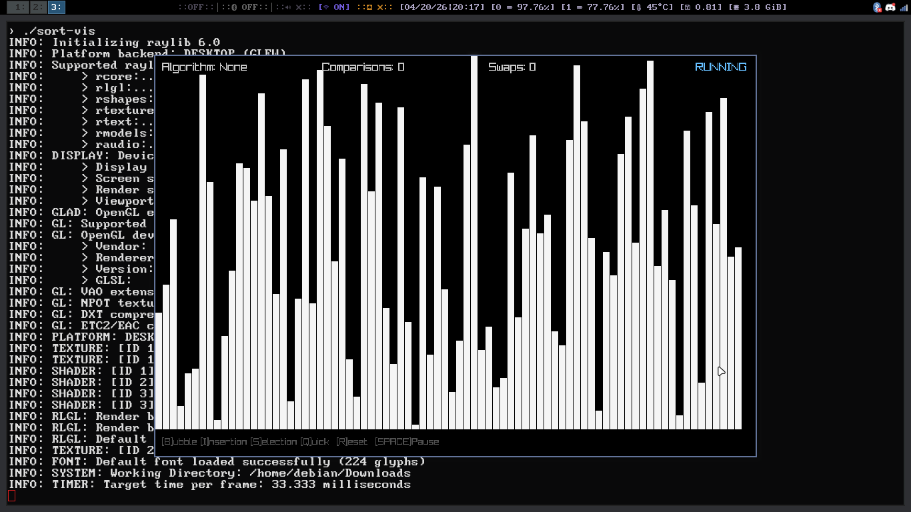

# c-visualization
https://github.com/raysan5/raylib

Cool little project that I am working on using C and raylib. Going to be add other sorts of algorithms ranging from **beginner** to **advanced.** 
<h2>#todo</h2> 

**EASY**  
- Bubble sort [-]  
- Bogo sort [ ]  

**MEDUIM**  
N/A 

**ADVANCE**  
- Merge Sort [ ]
# How To Complie and Run:
To complie the `sort-vis.c`, put: `gcc sort-vis.c -o sort-vis -lraylib -lm -lpthread -ldl` then run `./sort.vis`

*ex. of what it should look like:*

